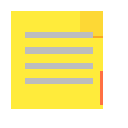

# Sticky Notes 📝

A powerful browser extension for creating, managing, and organizing sticky notes on any webpage. Create, color, pin, and manage sticky notes on any website with undo-delete, touch support, and a built-in markdown renderer.



## What's New in v2.0.0

### ✨ New Features
- **🎨 Color Picker** — Choose from 6 colors (Yellow, Pink, Blue, Green, Purple, White)
- **↔️ Resize Notes** — Drag corner handle to resize any note
- **─ Minimize / Restore** — Collapse notes to save screen space
- **📤 Export** — Download all notes as a JSON backup file
- **📥 Import** — Restore notes from a JSON backup
- **🔢 Note Counter** — Badge on the extension icon shows total note count
- **External Stylesheet** — Clean, modern CSS with smooth transitions

### 🐛 Bug Fixes
- Added debounced save (300ms) — no more constant storage writes while typing
- Proper error handling on all `chrome.runtime.sendMessage` calls
- Memory leak prevention — listeners are cleaned up properly
- Fixed global document event pollution in drag handler
- Z-index management — active note always on top
- Scrollbars styled for modern look

### 📁 Code Refactor
- Split one 740-line file into **7 focused modules**
  - `config.js` — Constants and defaults
  - `ui.js` — Note creation, layout, color updates
  - `drag.js` — Draggable mechanics with proper cleanup
  - `storage.js` — Debounced CRUD operations
  - `dashboard.js` — The "All Notes" view
  - `features.js` — Resize, minimize, color picker, export/import
  - `content.js` — Main entry point
- Extracted all CSS from inline template strings into `styles.css`
- Async/promise-based storage layer
- Clean separation of concerns

## Features

### Core
- Create sticky notes on any webpage
- Edit note content with rich text (contentEditable)
- Drag and reposition notes anywhere on the page (mouse + touch)
- Resize notes to any dimension
- Minimize notes to save space
- Pin notes to keep them on top (`Ctrl+Shift+P`)
- Choose from 6 colors per note — with hover preview
- Notes persist when you return to the page
- Viewport-aware positioning — notes always appear on-screen

### Dashboard
- View all your notes from different websites in one dashboard
- Paginated dashboard (25 notes per page)
- Search notes by content or URL
- Keyboard navigation (`↑↓` to select, `Delete` to remove)

### Data
- Export all notes to JSON for backup
- Import notes from JSON backup (merge or replace mode)
- Undo delete — 5-second restore window after deleting a note
- Confirmation modal (no more `alert()`/`confirm()`)

### Keyboard Shortcuts
| Shortcut | Action |
|---|---|
| `Ctrl+Shift+N` | Create new note |
| `Ctrl+Shift+D` | Toggle dashboard |
| `Ctrl+Shift+P` | Pin/unpin focused note |
| `Ctrl+Shift+E` | Export notes |
| `Ctrl+Shift+I` | Import notes |
| `Ctrl+S` | Force save |
| `Escape` | Close dashboard/color picker |

### Other
- Dark mode support
- Markdown rendering per note
- Right-click context menu on notes
- Character count in note footer
- Cross-browser compatibility (Chrome, Edge; Firefox requires Manifest V2 adaptation)
- Note count badge on extension icon

## Installation

### From Web Store

Coming soon!

### Manual Installation (Developer Mode)

1. Download or clone this repository
2. Open Chrome and navigate to `chrome://extensions/`
3. Enable "Developer mode" in the top-right corner
4. Click "Load unpacked" and select the extension directory
5. The Sticky Notes extension should now appear in your extensions list
6. Click the icon to create your first note!

## Usage

1. Click the Sticky Notes icon in your browser toolbar to create a new note
2. Type your content in the note
3. Drag the note by its header to reposition it
4. Resize by dragging the bottom-right corner handle
5. Minimize with the `─` button (restore with `□`)
6. Change color with the 🎨 button
7. Notes are automatically saved
8. Click `☰` on any note to view all your notes across different websites
9. In the dashboard, use 📤 Export or 📥 Import to manage backups
10. Click `✕` to delete a note

## Architecture

```
sticky-notes/
├── manifest.json       # Extension config (Manifest v3)
├── content.js          # Entry point
├── background.js       # Service worker (storage + badge)
├── styles.css          # All styles (was inline in v1)
├── modules/
│   ├── config.js       # Constants, defaults
│   ├── ui.js           # Note DOM creation, layout
│   ├── drag.js         # Drag logic with cleanup
│   ├── storage.js      # CRUD + debounced save
│   ├── dashboard.js    # All-notes view
│   ├── features.js     # Resize, minimize, colors, export, import, undo-delete
│   ├── contextmenu.js  # Right-click context menu on notes
│   └── validation.js   # Shared validation logic
├── icons/
│   ├── icon16.png
│   ├── icon48.png
│   └── icon128.png
├── docs/
│   └── PUBLISHING.md
└── README.md
```

## How It Works

- Sticky Notes uses Chrome Extension Manifest v3 with `chrome.storage.local` for persistence
- Notes are associated with the URL they were created on
- Content scripts inject and manage notes on webpages
- A service worker background script handles data storage and communication
- Export provides a JSON backup with metadata (version, timestamp)
- Import validates format before replacing existing notes

## Privacy

- All your notes are stored **locally** on your device
- No data is sent to external servers
- Your notes are private to your browser profile
- Export files contain only your own note data

## Browser Compatibility

This extension is designed to work with:
- Google Chrome (v88+)
- Microsoft Edge (v88+)
- Firefox (requires Manifest V2 port — see CONTRIBUTING.md)

## Changelog

### v2.2.0 (May 2026)
- **Undo delete**: 5-second restore window with toast undo button
- **Touch support**: Drag notes on tablets/phones
- **Context menu**: Right-click on a note for Pin, Minimize, Color, Delete
- **Viewport-aware positioning**: Notes always appear within the visible viewport
- **Color picker preview**: Hover a color swatch to preview it on the note
- **Dashboard pagination**: 25 notes per page with prev/next navigation
- **Confirmation modals**: Styled modal dialogs replace `alert()`/`confirm()`
- **Storage race condition fix**: Multi-tab writes merge safely (last-write-wins per note)
- **esbuild bundler**: Replaced fragile regex-based bundler with esbuild for sourcemaps and reliability
- **ESLint**: Proper config with `webextensions` env (no more `no-undef: off`)
- **CI**: Test step added to GitHub Actions workflow
- **ValidateImportData**: Deduplicated into shared `validation.js` module
- **Unit tests**: Comprehensive sanitizer tests (30 cases), storage merge tests, expanded markdown tests
- **Keyboard shortcuts**: Added `Ctrl+Shift+P` for pin toggle
- **Character count**: Live character count in note footer
- **rAF drag**: Smooth `requestAnimationFrame`-based drag movement
- **README**: Updated with full keyboard shortcuts table and feature list

### v2.0.0 (April 2026)
- Complete refactor to modular architecture
- Added resize, minimize, color picker
- Added export/import JSON backup
- Added note count badge
- Added debounced save
- Extracted CSS to external stylesheet
- Fixed memory leaks and event cleanup
- Improved error handling throughout

### v1.1.2
- Initial release
- Basic create, edit, drag, delete
- Dashboard view
- Simple inline CSS
- Payment placeholder

## Support Development

If you find this extension useful, consider supporting by:
- Starring ⭐ this repository
- Reporting bugs and suggesting features
- Contributing code improvements

## License

This project is licensed under the MIT License.

---

<p align="center">Built with ❤️ using Manifest v3</p>
