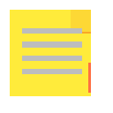

# Sticky Notes 📝

A powerful browser extension for creating, managing, and organizing sticky notes on any webpage. Create, color, pin, and manage sticky notes on any website with undo-delete, touch support, and a built-in markdown renderer.



## Features

### Core
- Create sticky notes on any webpage
- Edit note content with rich text (contentEditable)
- Drag and reposition notes anywhere on the page (mouse + touch)
- Resize notes to any dimension
- Minimize notes to save space
- Pin notes to keep them on top (`Ctrl+Shift+P`)
- Choose from 6 colors per note — with hover preview
- Notes persist when you return to the page
- Viewport-aware positioning — notes always appear on-screen

### Dashboard
- View all your notes from different websites in one dashboard
- Paginated dashboard (25 notes per page)
- Search notes by content or URL
- Keyboard navigation (`↑↓` to select, `Delete` to remove)

### Data
- Export all notes to JSON for backup
- Import notes from JSON backup (merge or replace mode)
- Undo delete — 5-second restore window after deleting a note
- Confirmation modal (no more `alert()`/`confirm()`)

### Keyboard Shortcuts
| Shortcut | Action |
|---|---|
| `Ctrl+Shift+N` | Create new note |
| `Ctrl+Shift+D` | Toggle dashboard |
| `Ctrl+Shift+P` | Pin/unpin focused note |
| `Ctrl+Shift+E` | Export notes |
| `Ctrl+Shift+I` | Import notes |
| `Ctrl+S` | Force save |
| `Escape` | Close dashboard/color picker |

### Other
- Dark mode support
- Markdown rendering per note
- Right-click context menu on notes
- Character count in note footer
- Cross-browser compatibility (Chrome, Edge; Firefox requires Manifest V2 adaptation)
- Note count badge on extension icon

## Installation

### From Web Store

Coming soon!

### Manual Installation (Developer Mode)

1. Download or clone this repository
2. Open Chrome and navigate to `chrome://extensions/`
3. Enable "Developer mode" in the top-right corner
4. Click "Load unpacked" and select the extension directory
5. The Sticky Notes extension should now appear in your extensions list
6. Click the icon to create your first note!

## Usage

1. Click the Sticky Notes icon in your browser toolbar to create a new note
2. Type your content in the note
3. Drag the note by its header to reposition it
4. Resize by dragging the bottom-right corner handle
5. Minimize with the `─` button (restore with `□`)
6. Change color with the 🎨 button
7. Notes are automatically saved
8. Click `☰` on any note to view all your notes across different websites
9. In the dashboard, use 📤 Export or 📥 Import to manage backups
10. Click `✕` to delete a note

## Architecture

```
sticky-notes/
├── manifest.json       # Extension config (Manifest v3)
├── content.js          # Entry point
├── background.js       # Service worker (storage + badge)
├── styles.css          # All styles (was inline in v1)
├── modules/
│   ├── config.js       # Constants, defaults
│   ├── ui.js           # Note DOM creation, layout
│   ├── drag.js         # Drag logic with cleanup
│   ├── storage.js      # CRUD + debounced save
│   ├── dashboard.js    # All-notes view
│   ├── features.js     # Resize, minimize, colors, export, import, undo-delete
│   ├── contextmenu.js  # Right-click context menu on notes
│   └── validation.js   # Shared validation logic
├── icons/
│   ├── icon16.png
│   ├── icon48.png
│   └── icon128.png
├── docs/
│   └── PUBLISHING.md
└── README.md
```

## How It Works

- Sticky Notes uses Chrome Extension Manifest v3 with `chrome.storage.local` for persistence
- Notes are associated with the URL they were created on
- Content scripts inject and manage notes on webpages
- A service worker background script handles data storage and communication
- Export provides a JSON backup with metadata (version, timestamp)
- Import validates format before replacing existing notes

## Privacy

- All your notes are stored **locally** on your device
- No data is sent to external servers
- Your notes are private to your browser profile
- Export files contain only your own note data

## Browser Compatibility

This extension is designed to work with:
- Google Chrome (v88+)
- Microsoft Edge (v88+)
- Firefox (requires Manifest V2 port — see CONTRIBUTING.md)

## Support Development

If you find this extension useful, consider supporting by:
- Starring ⭐ this repository
- Reporting bugs and suggesting features
- Contributing code improvements

## License

This project is licensed under the MIT License.

---

<p align="center">Built with ❤️ using Manifest v3</p>
